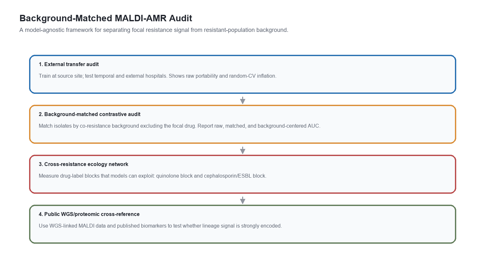
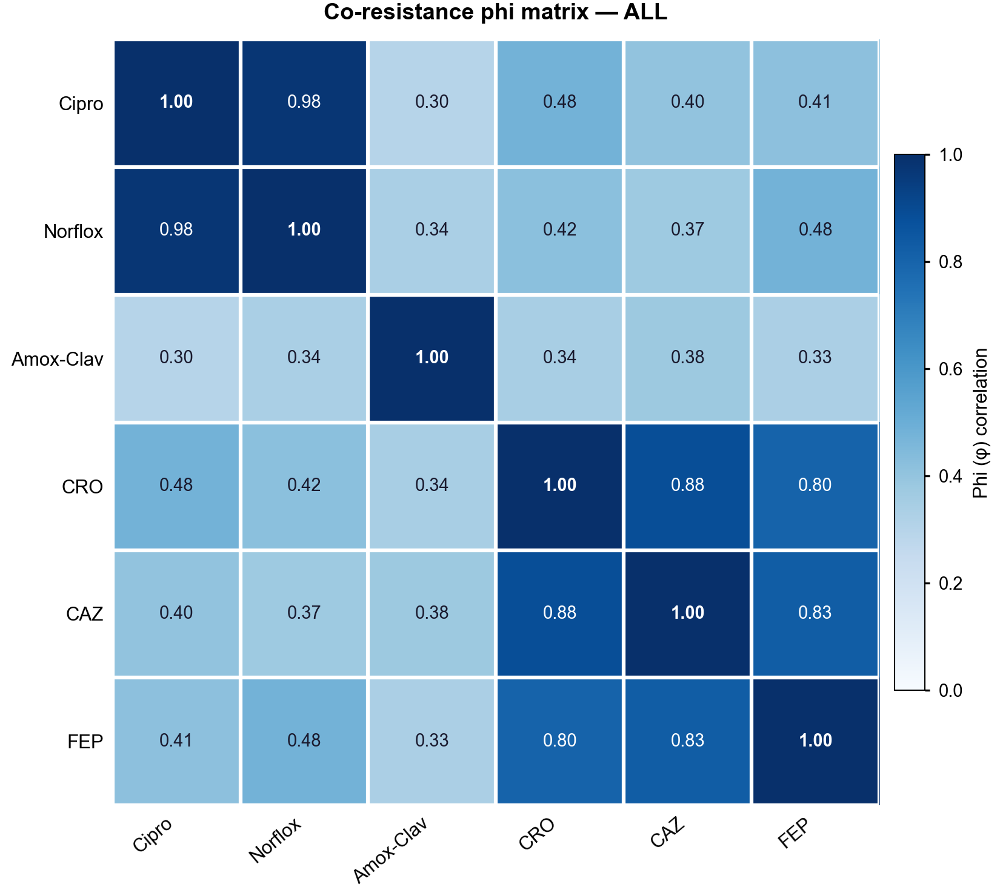
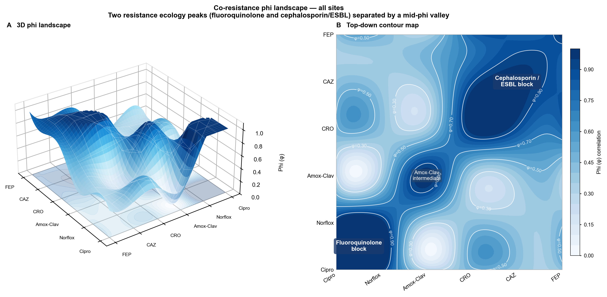
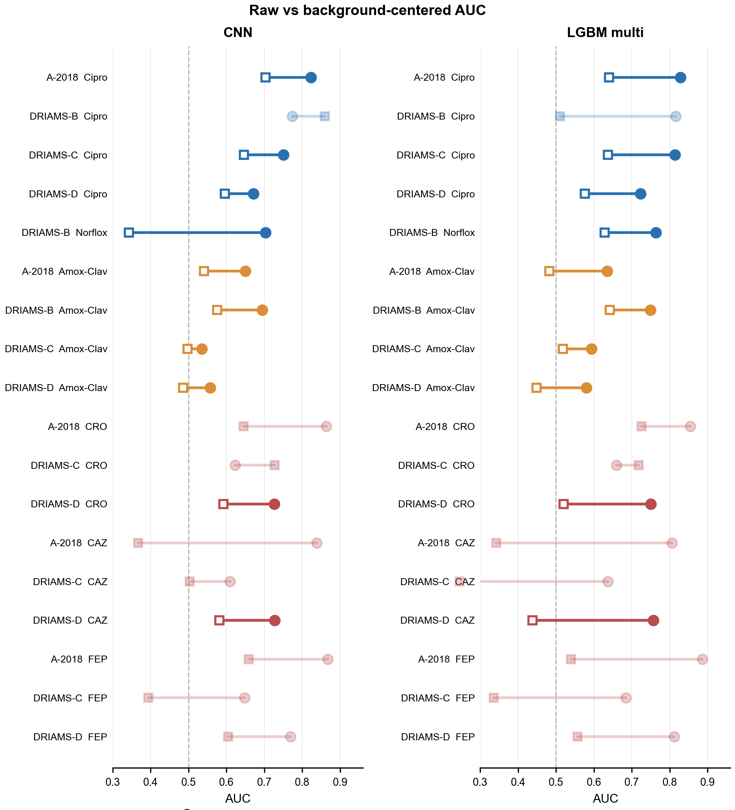
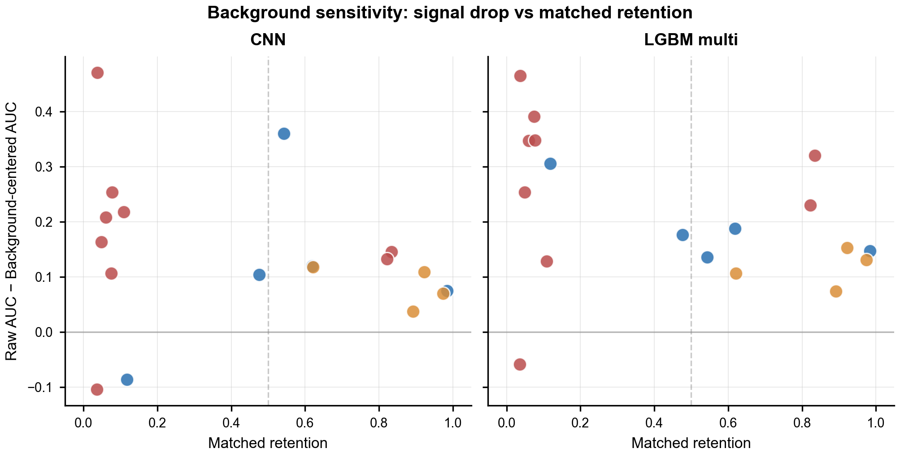
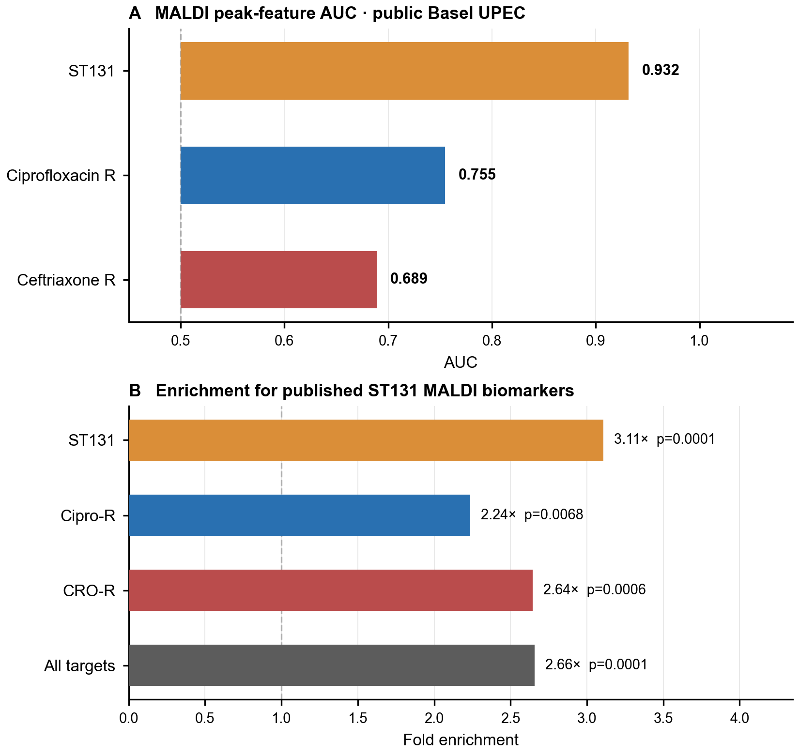

# Background-Matched MALDI-AMR Audit

**Can MALDI-TOF mass spectrometry genuinely predict antibiotic resistance - or does it just recognise resistant bacteria as a population?**

This repository provides a model-agnostic audit framework that separates *focal-drug resistance signal* from *resistant-population background* in MALDI-TOF antimicrobial resistance (AMR) prediction models. We apply it to CNN/Mega, LightGBM, and Weis-style logistic-regression prediction exports across DRIAMS sites, then cross-reference the findings against publicly available whole-genome sequencing (WGS) and published ST131 proteomic biomarkers.

> **Key finding.** Raw MALDI-AMR AUC can be decomposed into co-resistance-only shortcut signal, matched within-background signal, and residual background-centered MALDI signal. In *E. coli*, ciprofloxacin retains partial, site-dependent within-background signal, while amoxicillin-clavulanic acid weakens or collapses toward chance at external sites. In a focused second-organism check, *S. aureus*/oxacillin retains MALDI signal at A-2018 and DRIAMS-C beyond the co-resistance-only baseline. Independent WGS-linked UPEC data show that ST131 lineage is strongly detectable from MALDI peaks, making lineage-associated shortcut signal biologically plausible.

---

## Quick Start - No DRIAMS Access Required

The audit engine is model-agnostic. Run it on the included synthetic example data in under a minute:

```bash
# 1. Set up the environment
python3.11 -m venv .venv
source .venv/bin/activate        # Windows: .venv\Scripts\activate
python -m pip install -r requirements.txt       # or: mamba env create -f environment.yml

# 2. (Optional) regenerate the example CSV
python scripts/generate_example_data.py

# 3. Run the audit
python run_background_audit_framework.py \
    --predictions-csv example_predictions.csv \
    --output-dir outputs/example_run
```

`example_predictions.csv` contains 300 synthetic *E. coli* and 320 synthetic *S. aureus* isolates across two sites (2,480 total prediction rows).
It is constructed so that the audit recovers two archetypal outcomes:

| Drug | Expected outcome |
|---|---|
| Ciprofloxacin | **Survives** - drug-specific signal retained after matching |
| Norfloxacin | **Survives** - same chromosomal fluoroquinolone mechanism |
| Ceftriaxone | **Collapses** - score tracks co-resistance background, not label |
| Amoxicillin-Clavulanic acid | **Collapses** - background-driven |

To run the audit on your own model's predictions, see [Input/Output Schema](#inputoutput-schema) below.
To run the audit across many model/organism/drug prediction tables as an atlas, see
[`docs/audit_atlas.md`](docs/audit_atlas.md).

---

## The Problem

Standard susceptibility testing (AST) takes 2-4 days. MALDI-TOF already identifies bacterial species in minutes from the same sample. A growing body of work claims MALDI models can *also* predict resistance, potentially collapsing the wait to under an hour.

However, resistant bacteria are not a random sample. Bacteria resistant to ciprofloxacin are often also resistant to ceftriaxone, ceftazidime, and cefepime - they cluster together in co-resistance blocks. A model that learns to recognise this resistant-population background will appear to predict each individual drug well, even if it has learned nothing drug-specific. Raw AUC alone cannot distinguish these two cases.

---

## The Framework



The audit proceeds in six linked steps:

1. **Prediction-table input** - start from isolate-level model outputs: isolate ID, site, year, organism, drug, binary AST label, and predicted probability.
2. **Raw transfer audit** - measure ordinary raw AUC before background control.
3. **Co-resistance-only baseline** - predict the focal drug from the non-focal AST pattern alone, with no MALDI spectra, to quantify shortcut signal already present in the label ecology.
4. **Background-matched contrastive audit** - group isolates by their co-resistance profile excluding the focal drug, then measure matched AUC, background-centered AUC, pairwise within-background accuracy, and matched retention.
5. **Model and organism replication** - repeat the audit across CNN/Mega, LightGBM variants, Weis-style LR exports, and the focused *S. aureus*/oxacillin second-organism check.
6. **Biological support** - use cross-resistance networks plus public WGS-linked MALDI and ST131 biomarker enrichment to interpret why some residual signals survive and others collapse.

### Current Manuscript Figure Set

The latest publication vector figures are in [`manuscript/figures/`](manuscript/figures/):

| Figure | File | Role in the argument |
|---|---|---|
| Fig. 1 | [`figure_1_framework.pdf`](manuscript/figures/figure_1_framework.pdf) | Defines the model-agnostic audit workflow and metrics. |
| Fig. 2 | [`figure_2_primary_background_audit.pdf`](manuscript/figures/figure_2_primary_background_audit.pdf) | Primary *E. coli* contrast: ciprofloxacin retained, amox-clav weak/collapsed. |
| Fig. 3 | [`figure_3_model_family_replication.pdf`](manuscript/figures/figure_3_model_family_replication.pdf) | CNN/Mega, LightGBM, Weis/Borgwardt LR, and second-organism model-family robustness. |
| Fig. 4 | [`figure_5_public_wgs_proteomic_support.pdf`](manuscript/figures/figure_5_public_wgs_proteomic_support.pdf) | Independent WGS-linked UPEC support for lineage-associated MALDI signal. |
| Supp. Fig. S1 | [`figure_4_cross_resistance_network.pdf`](manuscript/figures/figure_4_cross_resistance_network.pdf) | Full co-resistance network/label ecology. |
| Supp. Fig. S2 | [`figure_6_falsification_controls.pdf`](manuscript/figures/figure_6_falsification_controls.pdf) | Background-burden and shuffled-label guardrails. |
| Supp. Fig. S3 | [`figure_7_saureus_oxacillin_audit.pdf`](manuscript/figures/figure_7_saureus_oxacillin_audit.pdf) | Focused *S. aureus*/oxacillin background-matched extension. |
| Supp. Fig. S4 | [`figure_8_three_way_decomposition.pdf`](manuscript/figures/figure_8_three_way_decomposition.pdf) | Four-panel, three-score decomposition: raw MALDI AUC vs co-resistance-only AUC vs background-centered MALDI AUC across *E. coli*, *S. aureus*, and *K. pneumoniae* examples. |
| Supp. Fig. S5 | [`figure_9_deployment_decision_flow.pdf`](manuscript/figures/figure_9_deployment_decision_flow.pdf) | Deployment decision flow for retained, collapsed, and sparse audit outcomes. |
| Supp. Fig. S6 | [`figure_10_framework_comparison.pdf`](manuscript/figures/figure_10_framework_comparison.pdf) | Positioning against Weis stratification and general reporting frameworks. |
| Supp. Fig. S7 | [`figure_11_audit_atlas_summary.pdf`](manuscript/figures/figure_11_audit_atlas_summary.pdf) | Audit atlas summary across model, organism, drug, and site extensions. |

The PNG summaries in [`outputs/final_framework_outputs/`](outputs/final_framework_outputs/) provide a repository-friendly view of the same audit logic, including raw-to-centered AUC, matched-retention diagnostics, co-resistance structure, WGS support, falsification controls, deployment rules, and published-style model comparisons.

---

## Co-Resistance Landscape

The phi correlation heatmap below shows why background matching is necessary. Ciprofloxacin and norfloxacin are nearly always co-resistant (phi = 0.98). Ceftriaxone, ceftazidime, and cefepime form a tight ESBL/AmpC block (phi = 0.80-0.88). Any model trained on these labels can exploit this structure.



The 3D phi landscape makes the block structure explicit - two peaks (fluoroquinolone block and cephalosporin/ESBL block) separated by a mid-phi valley.



---

## Primary Results

### Raw vs Background-Centered AUC

Each row is one site/drug combination. The circle is the raw external AUC; the square is the stratum-centered AUC after background matching. A large gap between the two indicates the raw performance was inflated by co-resistance background. Results are shown for both the CNN and LightGBM to confirm model-family independence.



**Reading the figure:**
- Blue (fluoroquinolone): ciprofloxacin retains substantial signal after matching at all well-powered sites.
- Orange (mixed beta-lactam): amoxicillin-clavulanic acid collapses to near-chance after matching across both model families.
- Red (cephalosporin/ESBL): ceftriaxone, ceftazidime, and cefepime are mostly low-powered or background-driven after matching.

### Signal Drop vs Matched Retention

The scatter below shows how much AUC was lost after matching (y-axis) against how many isolates survived matching (x-axis). Points in the upper-left corner had high raw AUC driven largely by background - few matched pairs survive and most apparent performance disappears.



### Summary Table

| Drug | Raw AUC (range) | Centered AUC (range) | Verdict |
|---|---|---|---|
| Ciprofloxacin | 0.67 - 0.82 | 0.596 - 0.703 | Partial, site-dependent retention |
| Norfloxacin | 0.70 - 0.78 | 0.34 - 0.86 | Site-dependent; low matched support |
| Ceftriaxone | 0.62 - 0.87 | 0.59 - 0.73 | Partially survives; strongly attenuated |
| Ceftazidime | 0.61 - 0.84 | 0.37 - 0.72 | Mostly background-driven or underpowered |
| Cefepime | 0.65 - 0.87 | 0.39 - 0.66 | Background-driven or underpowered |
| Amox-Clavulanic acid | 0.54 - 0.69 | 0.49 - 0.58 | Weak/borderline or collapsed after matching |
| *S. aureus* / Oxacillin | 0.73 - 0.84 | 0.699 - 0.763 at interpretable sites | Second-organism retention check; DRIAMS-B sparse |

---

## Biological Mechanism: ST131 Lineage

To explain *why* ciprofloxacin prediction survives matching, we linked publicly available Basel UPEC MALDI spectra to whole-genome sequencing metadata. The ST131 lineage - a globally dominant high-risk *E. coli* clone - is detectable from MALDI peak features with AUC = 0.93. ST131 carries chromosomal fluoroquinolone resistance mutations at 20x higher odds than non-ST131 isolates.

Discriminative MALDI peak bins for each resistance target are enriched 2-3x for published ST131 proteomic biomarkers, well beyond a mass-matched permutation null.



| Target | MALDI AUC | Biomarker enrichment | Empirical p |
|---|---|---|---|
| ST131 lineage | 0.932 | 3.11x | < 0.0001 |
| Ciprofloxacin resistance | 0.755 | 2.24x | 0.0068 |
| Ceftriaxone resistance | 0.689 | 2.64x | 0.0006 |
| All targets combined | - | 2.66x | < 0.0001 |

The interpretation: MALDI detects ST131 through conserved surface protein markers. Because ST131 almost always carries chromosomal fluoroquinolone resistance (QRDR mutations), lineage detection indirectly predicts ciprofloxacin resistance. For cephalosporins, resistance is mediated by mobile ESBL/AmpC plasmids that vary across hospitals - hence the site-dependent, often background-driven signal.

---

## Data Stack

```
DRIAMS (Basel, Switzerland)
  Four hospital sites: A-2018, B, C, D
  ~4,500 E. coli isolates with paired MALDI-TOF spectra and AST labels
  Six drugs: Ciprofloxacin, Norfloxacin, Amox-Clavulanic acid,
             Ceftriaxone, Ceftazidime, Cefepime
  ->
  Raw spectra: not distributed (controlled access via DRIAMS portal)
  Isolate-level prediction CSVs: created by export scripts below

Public Basel UPEC dataset (Cuenod et al.)
  407 urinary E. coli isolates
  Paired Bruker MALDI median-peak features + WGS metadata
  ST131 lineage calls, ciprofloxacin/ceftriaxone resistance labels
  ->
  Bruker median-peak features: data_manifests/Bruker_csv_medianpeaks_df.csv
  WGS metadata bridge: data_manifests/upec_bruker_wgs_bridge.tsv

MARISMa (external stress-test)
  Independent Bruker MALDI E. coli snapshot
  Used to validate that DRIAMS-trained models do not blindly transfer
  ->
  Snapshot summary: outputs/analysis_outputs/marisma_external_validation/
```

---

## Repository Layout

```
background-matched-maldi-amr-audit/
|
|-- Mega_Model.py                        # CNN model engine (training, eval, export)
|-- run_background_audit_framework.py    # Model-agnostic audit - the core method
|
|-- scripts/
|   |-- run_training_ecoli6.py           # Train CNN on E. coli 6-drug panel
|   |-- run_training_clinical4.py        # Train CNN on clinical 4-pair profile
|   |-- run_lgbm_baselines.py            # Train multi-task LightGBM baselines
|   |-- export_mega_predictions_for_audit.py  # Export isolate-level CNN predictions
|   |-- run_background_audit.py          # Thin wrapper: run audit on default CSV
|   |-- run_public_upec_analysis.py      # WGS-linked MALDI + biomarker enrichment
|   |-- build_cross_resistance_network.py     # Phi/lift co-resistance network
|   |-- make_paper_figures.py            # Reproduce all manuscript figures
|   |-- make_final_framework_tables_figures.py
|   |-- marisma_end_to_end_kaggle.py     # MARISMa external stress-test
|   `-- background_matched_contrastive_kaggle.py
|
|-- data_manifests/                      # Public UPEC manifest and bridge tables
|-- model_checkpoints/                   # Locked CNN checkpoint archive (5 seeds)
|-- outputs/
|   |-- final_framework_outputs/         # Publication tables and figures
|   `-- analysis_outputs/               # Intermediate results and sub-analyses
|-- manuscript/                          # Nature Communications LaTeX manuscript + figures
|-- docs/                                # Reproduction guide, data availability notes
`-- tests/                               # Regression tests for audit and model helpers
```

---

## Reproducing the Analysis

Full step-by-step instructions are in [`docs/reproduce.md`](docs/reproduce.md). Data availability and redistribution notes are in [`docs/data_availability.md`](docs/data_availability.md).

**1. Train the CNN model**

```bash
python scripts/run_training_ecoli6.py --data-root /path/to/driams
```

**2. Export isolate-level predictions**

```bash
python scripts/export_mega_predictions_for_audit.py \
  --run-dir runs/exp_ecoli_mechanism6_drugid_mae30
```

**3. Run the background-matched audit**

```bash
python scripts/run_background_audit.py \
  --predictions-csv runs/exp_ecoli_mechanism6_drugid_mae30/metrics/mega_predictions_long.csv \
  --output-dir outputs/background_audit
```

**4. Run the public UPEC WGS / proteomic support analysis**

```bash
python scripts/run_public_upec_analysis.py \
  --median-peaks data_manifests/Bruker_csv_medianpeaks_df.csv
```

**5. Reproduce all paper figures and tables**

```bash
python scripts/make_paper_figures.py
```

### Input/Output Schema

**Input** - one long CSV with one row per isolate/drug prediction:

| Column | Type | Description |
|---|---|---|
| `isolate_id` | string | Unique isolate identifier |
| `site` | string | Hospital or laboratory site |
| `year` | string | Collection year |
| `organism` | string | Species name (e.g. `Escherichia coli`) |
| `drug` | string | Antibiotic name (e.g. `Ciprofloxacin`) |
| `label` | 0 / 1 | Susceptible (0) or Resistant (1) |
| `prob` | float [0,1] | Model predicted probability of resistance |
| `model_name` | string | *(optional)* model label for multi-model runs |

Column names are configurable via `--id-col`, `--drug-col`, etc. - see `--help`.
Background signatures are derived automatically from the other drug labels for each isolate.

**Key outputs** in `--output-dir`:

| File | Contents |
|---|---|
| `background_matched_audit_summary.csv` | Per site/drug: raw AUC, stratum-centered AUC, CI, permutation p, adequacy label |
| `background_matched_sensitivity.csv` | Same metrics repeated under n>=2, n>=3, n>=5 stratum-size thresholds |
| `background_matched_retained_rows.csv` | Matched isolate rows with background signatures and stratum assignments |
| `cross_resistance_edges.csv` | Pairwise phi and lift co-resistance statistics |
| `background_audit_report.md` | Human-readable summary with interpretation categories |

Sensitivity to the minimum-stratum-size threshold is reported automatically. The default thresholds are n>=2, n>=3, n>=5; adjust with `--sensitivity-thresholds`.

---

## Key Claims and Their Status

| Claim | Status | Supporting output |
|---|---|---|
| Ciprofloxacin prediction retains partial within-background signal | Confirmed at the main interpretable sites; DRIAMS-D is modest and DRIAMS-B is sparse | Table 1, Figure 2 |
| Amox-clavulanic acid is weak or background-sensitive after matching | Confirmed at the main external sites | Table 1, Figure 2 |
| Co-resistance-only baselines expose shortcut signal | Confirmed for several *E. coli* rows and used as the central decomposition | Figure 2, source data |
| *S. aureus*/oxacillin extends the framework beyond *E. coli* | Focused second-organism check with retained signal at interpretable sites | Figure 2, Supplementary Sa/Oxa figure/table |
| Audit atlas can summarize model/organism/drug/site extensions | Implemented as a reusable runner with atlas matrix, calibration, sensitivity, and locked-expectation checks | `docs/audit_atlas.md`, Supplementary audit atlas figure |
| Cephalosporin predictions are site-dependent | Partially confirmed | Table 2, Table 3 |
| Fluoroquinolone signal transfers across hospitals | Partially confirmed | Table 4 |
| MALDI encodes ST131 lineage in public UPEC data | Confirmed (AUC = 0.932) | Figure 4, public WGS source data |
| Resistance-associated peaks enriched for ST131 biomarker neighborhoods | Confirmed (2-3x, p < 0.01) | Figure 4, biomarker source data |
| Source thresholds do not transport to target hospitals | Confirmed | Table 6 |

---

## Included Outputs

Pre-computed outputs are provided so the audit results can be inspected without re-running training:

- `outputs/final_framework_outputs/` - numbered paper tables, repository PNG summaries, deployment checks, falsification controls, calibration summaries, and published-style model-audit outputs
- `outputs/analysis_outputs/cross_resistance_network/` - per-site phi heatmaps and network SVGs
- `outputs/analysis_outputs/upec_wgs_validation_outputs/` - ST131 / ciprofloxacin / ceftriaxone classification results
- `outputs/analysis_outputs/updated_proteomic_overlap_outputs/` - biomarker enrichment permutation results
- `docs/audit_atlas.md` - instructions for running the multi-model audit atlas and locked expectation checks
- `model_checkpoints/mega_cnn_archive_2026-04-22/` - five-seed locked CNN checkpoint archive

These are analysis artifacts derived from the DRIAMS and public UPEC datasets. Raw spectra and AST tables are not included.

---

## Relationship to Prior Work

This audit builds on and responds to several lines of MALDI-AMR research.

**Weis et al. (2022) / Borgwardt lab** introduced multi-task LightGBM for MALDI-AMR prediction across DRIAMS sites and reported external-site AUC in the 0.6-0.8 range for *E. coli* and *S. aureus* targets. We apply the background-matched audit to their exported predictions (see `scripts/export_weis_predictions_for_audit.py`) and show that the *E. coli* performance gap between drugs is largely explained by co-resistance structure rather than drug-specific biology.

**Yu et al. and subsequent deep-learning approaches** train CNN or transformer models on raw spectra and report similar or higher raw AUC values. The background-matched framework is model-agnostic and applies identically: any model producing a `(isolate_id, drug, label, prob)` CSV can be audited.

**TRIPOD+AI / PROBAST+AI** checklist frameworks flag confounding and spectrum bias as key risks in diagnostic AI. Our background-matching step is a concrete statistical operationalization of the confounding check: it estimates how much reported AUC is attributable to the resistant-population background rather than the focal drug signal. A model that passes background matching also satisfies the PROBAST+AI discrimination domain for background confounding.

The key distinction from stratified subgroup analyses (e.g. stratifying by site or year) is that background matching stratifies on *co-resistance phenotype*, directly isolating the source of the confound rather than a proxy for it.

---

## Citation

If you use this framework or any of its outputs, please cite:

```bibtex
@software{background_matched_maldi_amr_audit,
  author    = {Kim, Byung and Wang, Yucheng},
  title     = {Background-Matched MALDI-AMR Audit},
  year      = {2026},
  url       = {https://github.com/byungkim113/background-matched-maldi-amr-audit}
}
```

See also [`CITATION.cff`](CITATION.cff) for the formal citation metadata.

---

## License

See [`LICENSE`](LICENSE) for terms. Raw DRIAMS data is subject to separate access conditions via the DRIAMS data portal. The public UPEC/Cuenod dataset is distributed under its original terms.
